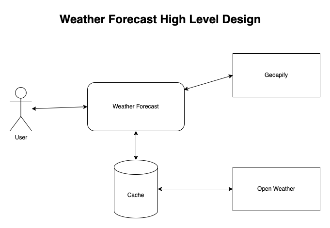

# Weather Forecast API

This is a simple Rails API application that accepts an address as input, retrieves forecast data for the given address using the `geocoder` and `open_weather` gems, and displays the forecast details to the user. The forecast details are cached for 30 minutes for all subsequent requests, and an indicator is shown if the result is pulled from the cache.

## Requirements

- Ruby 2.7 or later
- Rails 7.1 or later
- Geocoding service: Geoapify
- Weather service: OpenWeather

## Setup

### Clone the Repository

```bash
git clone https://github.com/kowusu/weather_forecast.git
cd weather_forecast
```

### Install Dependencies

```bash
bundle install
```

### Configure Environment Variables

Create a **.env** file in the root directory of your project and add your Geoapify and OpenWeather API keys:

```bash
echo "GEOAPIFY_API_KEY=your_geoapify_api_key" >> .env
echo "OPENWEATHER_API_KEY=your_openweather_api_key" >> .env
```

### Set Up the Database

```bash
rails db:create db:migrate
```

### Start the Server

```bash
rails server
```

The server will start on http://localhost:3000.

## Usage

### Fetch Forecast Data

To fetch the forecast data, send a GET request to the **/forecast** endpoint with the desired address as a query parameter. Here are some examples:

- Single-line address:
  ```bash
  curl "http://localhost:3000/forecast?address=20+W+34th+St.,+New+York,+NY,+10001"
  ```
- Separate address components:
  ```bash
  curl "http://localhost:3000/forecast?street=20+W+34th+St.&city=New+York&state=NY&zip=10001"
  ```
- Latitude and longitude:
  ```bash
  curl "http://localhost:3000/forecast?lat=40.7484&lon=73.9857"
  ```
- Postal code only:
  ```bash
  curl "http://localhost:3000/forecast?zip=10001"
  ```

## High Level System Design



## Implementation Details

### Geocoding Service

The **GeocodingService** class is responsible for converting an address to coordinates using the **geocoder** gem configured to use the Geoapify API. It handles various address formats including single-line addresses, separate address components, latitude and longitude, and postal codes.

### Weather Forecast Service

The forecast data is fetched using the **open_weather** gem configured to use the OpenWeather API. The data includes the current temperature, high, and low for the day.

### Caching

Forecast data is cached for 30 minutes using Rails' caching mechanism. The cache key is based on the coordinates, and a cache indicator is included in the response to show if the result was pulled from the cache.

### ForecastsController

The **ForecastsController** handles the **/forecast** endpoint and performs the following steps:

1. Fetch coordinates using the **GeocodingService**.
2. Fetch forecast data using the **open_weather** gem.
3. Cache the forecast data for 30 minutes.
4. Return the forecast data in the JSON response.

## Tests

### Running Tests

RSpec tests are provided to ensure the correct functionality of the geocoding and forecast retrieval services. To run the tests, use the following command:
```bash
bundle exec rspec
```